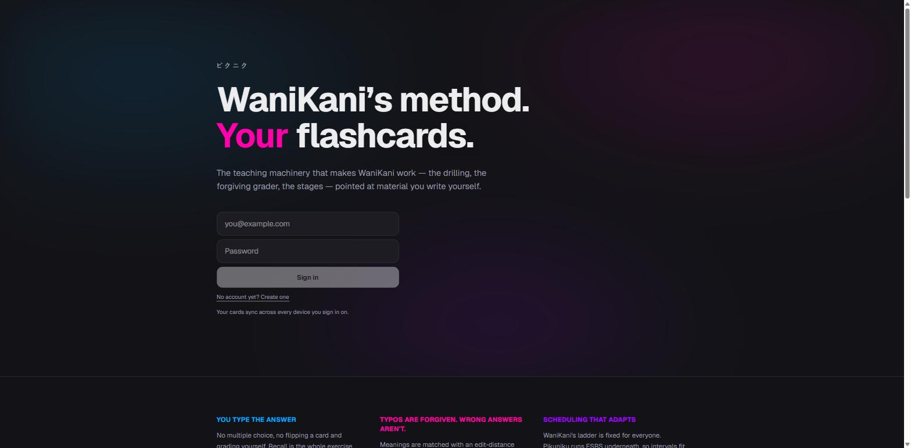
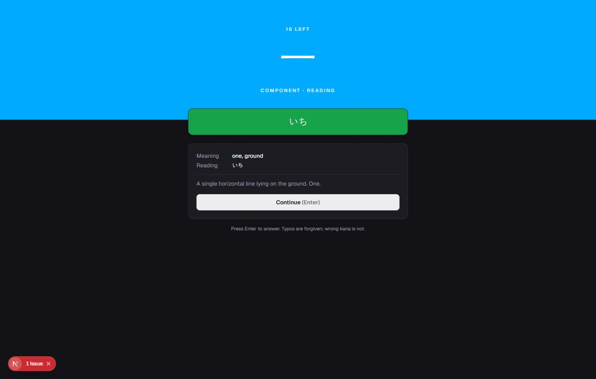
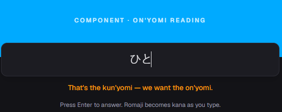
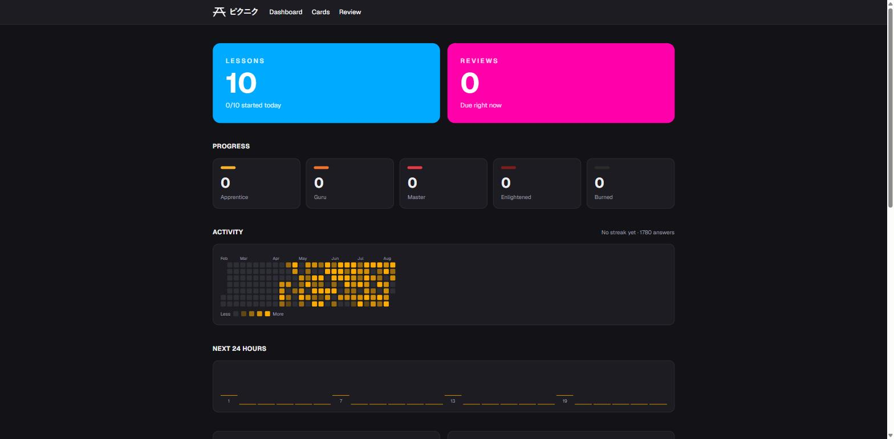
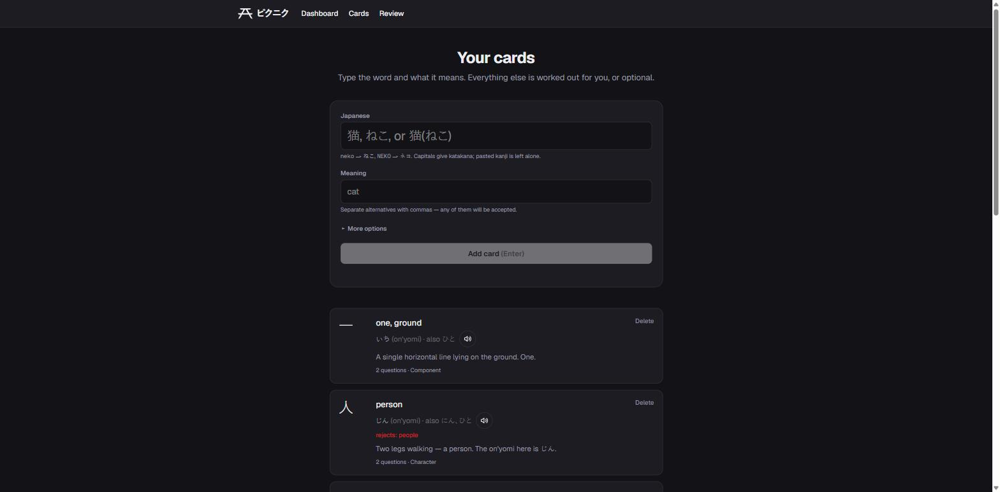

<div align="center">


# Pikuniku

**WaniKani's method. Your flashcards.**

A spaced-repetition trainer that borrows the machinery which makes
[WaniKani](https://www.wanikani.com) effective — the drilling, the forgiving grader, the
five stages — and points it at material you write yourself.

</div>

---

## Why

WaniKani works, but it teaches *its* curriculum. Anki lets you write your own cards, but
hands you a blank flashcard and a self-grade button. Pikuniku is the middle: you supply the
words, and it supplies the pedagogy.

The research behind it — how WaniKani's SRS ladder, unlocking model, session queue and
answer grading actually work, with sources — is written up in
[`WANIKANI-RESEARCH-AND-PLAN.md`](WANIKANI-RESEARCH-AND-PLAN.md).

<div align="center">

</div>

## How it works

### You type the answer

No multiple choice and no self-grading. Recall is the exercise, so you produce the answer
before the app shows you anything.

<div align="center">

</div>

### Typos are forgiven; wrong answers are not

Meanings are matched with an Optimal String Alignment distance whose tolerance scales with
the length of the expected answer — 0 edits under 4 characters, rising to `2 + ⌊L/7⌋` past
8. Readings are matched **exactly**, because a wrong kana is a wrong sound.

### There is a third answer state

Right, wrong, and *"that isn't what was asked"*. Typing English where kana belongs, or a
real reading that isn't the one being taught, shakes the box with a hint and costs you
nothing. Only genuine mistakes reach the scheduler.

<div align="center">

</div>

Reading prompts name which reading they want, so you are never guessing between 人's じん
and ひと — a bare "Reading" label is ambiguous the moment a character has both.

### Scheduling adapts, but keeps the ceremony

WaniKani's ladder is fixed for everyone. Pikuniku runs [FSRS](https://github.com/open-spaced-repetition/ts-fsrs)
underneath, so intervals fit the card and your history — but you are never asked to rate
your own recall. The grader's verdict becomes the rating:

| Grader result | FSRS rating |
|---|---|
| exact, answered fast | Easy |
| exact | Good |
| fuzzy match (a typo) | Hard |
| wrong | Again |

Apprentice → Guru → Master → Enlightened → Burned survive as a display layer derived from
stability, because "Burned" motivates and `stability = 47.3 days` does not.

### Paced, and visible

New material is capped per day, so a big import doesn't become a wall of reviews a week
later. Reviews themselves are never withheld — they're work already owed, and deferring
them is what breaks a schedule. An activity heatmap shows what you've actually done.

<div align="center">

</div>

### Missed questions can't come straight back

WaniKani will re-ask a question you just missed almost immediately, which tests working
memory rather than recall. Here a wrong answer sets a delay that is honoured as long as any
other question is available, and degrades gracefully at the end of a session.

### Leeches point at the card, not at you

In a deck you wrote yourself, an item you keep failing is usually an ambiguous answer, a
missing synonym, or two cards that should have been one. Cards failed repeatedly are
surfaced for editing — a fix a fixed-curriculum app cannot offer.

## Features

- **Two-field card entry.** Paste `猫(ねこ)` and the reading is split out for you; the card
  type is inferred; the reading field only appears when the word actually hides one.

  <div align="center">
  
  </div>

- **Kana input.** Romaji becomes kana as you type, via WaniKani's own
  [WanaKana](https://github.com/WaniKani/WanaKana) — `neko` → ねこ, and capitals give
  katakana, so `KO-HI-` → コーヒー.
- **Pronunciation** through the browser's speech synthesis — no audio files, and it speaks
  the *reading*, since synthesisers guess kanji and get 大人 wrong.
- **English → Japanese** production questions on every card that can carry one. A word that
  legitimately fits the prompt but belongs to another card is a retry, not a mistake.
- **Sync** across devices via Supabase, with row-level security and magic-link sign-in.

## Running it

```bash
npm install
npm run dev
```

Without Supabase configured it runs entirely on `localStorage`, seeded with a small demo
deck — enough to try the review loop.

### With Supabase

1. Create a project at [supabase.com](https://supabase.com).
2. Run [`supabase/migrations/0001_init.sql`](supabase/migrations/0001_init.sql) in the SQL
   editor. It creates three tables, enables RLS on all of them, and grants the review log
   `select` and `insert` only — it is append-only by policy, not by convention.
3. Add your keys to `.env.local`:

   ```
   NEXT_PUBLIC_SUPABASE_URL=https://<project>.supabase.co
   NEXT_PUBLIC_SUPABASE_PUBLISHABLE_KEY=sb_publishable_...
   ```

4. Add your dev URL to **Authentication → URL Configuration → Redirect URLs**.

### One voice on every device (optional)

Without this, pronunciation uses the browser's own speech synthesis, which means whichever
Japanese voice the OS installed — Microsoft's on Windows, Apple's compact Kyoko on a Mac,
nothing at all on some Linux boxes. The same word genuinely sounds different per machine.

The [`speak`](supabase/functions/speak/index.ts) edge function fixes that by synthesising
one pinned voice server-side. It stores nothing: audio is generated, returned, played and
dropped, and kept in memory only for the tab's lifetime.

1. Enable **Cloud Text-to-Speech API** in a Google Cloud project and create an API key.
   Restrict it to that one API.
2. Give it to Supabase — the key never reaches the browser:

   ```bash
   supabase secrets set GOOGLE_TTS_KEY=...
   supabase functions deploy speak --no-verify-jwt
   ```

   `--no-verify-jwt` turns off the *platform's* check, which only understands the legacy
   JWT-shaped keys; the function verifies the caller's session itself and refuses anyone
   who isn't signed in.

3. Optionally pin a different voice — `supabase secrets set TTS_VOICE=ja-JP-Wavenet-B`. To
   see what's on offer:

   ```bash
   curl "https://texttospeech.googleapis.com/v1/voices?languageCode=ja-JP&key=$KEY"
   ```

Deploy it or don't: with no function, a failed call, or no Supabase at all, pronunciation
falls back to the OS voice exactly as before.

## Deploying

Every route is static and Supabase is called from the browser, so it deploys as plain files.
Pushing to `main` builds and publishes to GitHub Pages via
[`.github/workflows/deploy.yml`](.github/workflows/deploy.yml); enable **Settings → Pages →
Source: GitHub Actions** once, and add the production URL to Supabase's redirect list.

## Layout

```
src/lib/
  grader.ts      answer checking — distance, normalisation, the three states
  scheduler.ts   FSRS wrapper; grader verdict → rating; stage labels
  session.ts     in-session queue, re-queue delay, half-finished cap
  cardinfer.ts   what can be worked out from a word and its meaning
  store.ts       one interface over Supabase and localStorage
  remote.ts      row ↔ domain mapping
  speech.ts      synthesised voice first, the OS voice as fallback
supabase/migrations/
supabase/functions/speak/   text in, Japanese audio out, nothing kept
```

## Credits

Built on ideas from [WaniKani](https://www.wanikani.com) by Tofugu, with
[WanaKana](https://github.com/WaniKani/WanaKana) and
[ts-fsrs](https://github.com/open-spaced-repetition/ts-fsrs). The session queue design
follows [KanjiSchool](https://github.com/Lemmmy/KanjiSchool); the grading constants were
confirmed against [Tsurukame](https://github.com/davidsansome/tsurukame).

Independent project — not affiliated with WaniKani or Tofugu.
